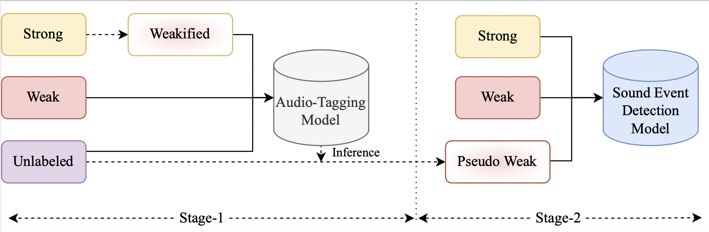

### DCASE2022 Task 4 Submission for Sound Event Detection in Domestic Environments.
---
### FMSG-NTU Submission for DCASE 2022 Task 4 

Please go through the [submitted technical report](https://drive.google.com/file/d/1GTrBU_95ZqvoAdmKDK3ACF0krZMRpB95/view?usp=sharing) to understand the system configurations developed in the work.

### Brief Description:
The proposed framework is divided into two stages: Stage-1 focuses on the audio-tagging system, which assists the sound event detection system in Stage-2. We train the Stage-1 utilizing a strongly labeled set converted into weak predictions, a weakly labeled set, and an unlabeled set to develop an effective audio-tagging system. This audio-tagging system is then used to infer on the unlabeled set to generate reliable pseudo-weak labels, which are used together with the strongly labeled set and weakly labeled set to train the sound event detection system at Stage-2. 

## Requirements

The script `conda_create_environment.sh` is available to create an environment which runs the
following code (recommended to run line by line in case of problems).

## Dataset
You can download the development dataset using the script: `generate_dcase_task4_2022.py`.
The development dataset is composed of two parts:
- real-world data ([DESED dataset][desed]): this part of the dataset is composed of strong labels, weak labels, unlabeled, and validation data which are coming from [Audioset][audioset].

- synthetically generated data: this part of the dataset is composed of synthetically soundscapes, generated using [Scaper][scaper]. 

### Usage:
Run the command `python generate_dcase_task4_2022.py --basedir="../../data"` to download the dataset (the user can change basedir to the desired data folder.)

If the user already has downloaded part of the dataset, it does not need to re-download the whole set. It is possible to download only part of the full dataset, if needed, using the options:

 - **only_strong** (download only the strong labels of the DESED dataset)
 - **only_real** (download the weak labels, unlabeled and validation data of the DESED dataset)
 - **only_synth** (download only the synthetic part of the dataset)

 For example, if the user already has downloaded the real and synthetic part of the set, it can integrate the dataset with the strong labels of the DESED dataset with the following command:

 `python generate_dcase_task4_2022.py --only_strong` 

 If the user wants to download only the synthetic part of the dataset, it could be done with the following command: 

 `python generate_dcase_task4_2022.py --only_synth`

Once the dataset is downloaded, the user should find the folder **missing_files**, containing the list of files from the real-world dataset (desed_real) which was not possible to download. You need to download it and **send your missing files to the task
organisers to get the complete dataset** (in priority to Francesca Ronchini and Romain serizel).

### Development dataset

The dataset is composed by 4 different splits of training data: 
- Synthetic training set with strong annotations
- Strong labeled training set **(only for the SED Audioset Systems (S-2, S-3, S-4))**
- Weak labeled training set 
- Unlabeled in domain training set

#### Synthetic training set with strong annotations

This set is composed of **10000** clips generated with the [Scaper][scaper] soundscape synthesis and augmentation library. The clips are generated such that the distribution per event is close to that of the validation set.

The strong annotations are provided in a tab separated csv file under the following format:

`[filename (string)][tab][onset (in seconds) (float)][tab][offset (in seconds) (float)][tab][event_label (string)]`

For example: YOTsn73eqbfc_10.000_20.000.wav 0.163 0.665 Alarm_bell_ringing

#### Strong labeled training set 

This set is composed of **3470** audio clips coming from [Audioset][audioset]. 

**This set is used at training only for the SED Audioset baseline.** 

The strong annotations are provided in a tab separated csv file under the following format:

`[filename (string)][tab][onset (in seconds) (float)][tab][offset (in seconds) (float)][tab][event_label (string)]`

For example: Y07fghylishw_20.000_30.000.wav 0.163 0.665 Dog

#### Weak labeled training set 

This set contains **1578** clips (2244 class occurrences) for which weak annotations have been manually verified for a small subset of the training set. 

The weak annotations are provided in a tab separated csv file under the following format:

`[filename (string)][tab][event_labels (strings)]`

For example: Y-BJNMHMZDcU_50.000_60.000.wav Alarm_bell_ringing,Dog

#### Unlabeled in domain training set

This set contains **14412** clips. The clips are selected such that the distribution per class (based on Audioset annotations) is close to the distribution in the labeled set. However, given the uncertainty on Audioset labels, this distribution might not be exactly similar.

The dataset uses [FUSS][fuss_git], [FSD50K][FSD50K], [desed_soundbank][desed] and [desed_real][desed]. 

For more information regarding the dataset, please refer to the [previous year DCASE Challenge website][dcase_21_dataset]. 

## Training
We provide **four** submitted systems for the task:
- S-1 FDY_CRNN + FDY_CRNN
- S-2 CNN-14-PANNs
- S-3 CNN-14-PANNs + FDY_CRNN
- S-4 CNN-14-PANNs + FDY_CRNN

### How to run any systems:
The systems can be run from scratch using the following commands:

`python train_stage_one_s_1.py`  
`python train_stage_two_s_1.py`  

`python train_stage_one_s_2.py --strong_real`  
`python train_stage_two_s_3.py --strong_real`  
`python train_stage_two_s_4.py --strong_real`  

### Generate Pseudo-Weak Labels for Stage-2 training
To generate pseudo-weak labels for stage-2 training, run the script:
For S-1 using FDY-CRNN (Stage-1):  
`python generate_pseudo_weak_labels_FDY_CRNN.py --test_from_checkpoint="/path/to/stage_1_model/"`  

For S-3, S-4 using PANNs (Stage-1):  
`python generate_pseudo_weak_labels_PANNs.py --test_from_checkpoint="/path/to/stage_1_model/"`  

The generated pseudo weak files will be saved in the ./recipes/dcase2022_task4_baseline/. To use these files please make sure to change the path in the yaml file for the corresponding Stage-2 file. 
Already generated files are provided in ./data/dcase/dataset/metadata/train/

unlabel_in_domain_pseudo_weak_ned.tsv: For S-1 (Stage-2)  
unlabel_in_domain_pseudo_weak.tsv : For S-3, S-4 (Stage-2)  

---
The tensorboard logs can be tested using the command `tensorboard --logdir="path/to/exp_folder"`. 

#### Results:

| **System** | **PSDS1** | **PSDS2** |
|:----------:|:---------:|:---------:|
|     B-1    |   0.336   |   0.536   |
|     B-2    |   0.351   |   0.552   |
|     S-1    |   0.474   |   0.730   |
|     S-2    |   0.102   |   0.840   |
|     S-3    |   0.472   |   0.721   |
|     S-4    |   0.088   |   0.837   |

**NOTES**:

All systems scripts assume that your data is in `../../data` folder in directory.
If your data is in another folder, you will have to change the paths of your data in the corresponding `data` keys in YAML configuration file in `conf/*.yaml`.
Note that `system_to_run.py` will create (at its very first run) additional folders with resampled data (from 44kHz to 16kHz)
so the user need to have write permissions on the folder where your data are saved.

**Hyperparameters** can be changed in the YAML file (e.g. lower or higher batch size).

The configuration YAML can be changed using `--conf_file="confs/system_to_run.yaml` argument.

The default directory for checkpoints and logging can be changed using `--log_dir="./exp/2022_baseline`.

Training can be resumed using the following command:

`python system_to_run.py --resume_from_checkpoint /path/to/file.ckpt`

#### References
[1] L. Delphin-Poulat & C. Plapous, technical report, dcase 2019.

[2] Turpault, Nicolas, et al. "Sound event detection in domestic environments with weakly labeled data and soundscape synthesis."

[3] Zhang, Hongyi, et al. "mixup: Beyond empirical risk minimization." arXiv preprint arXiv:1710.09412 (2017).

[4] Thomee, Bart, et al. "YFCC100M: The new data in multimedia research." Communications of the ACM 59.2 (2016)

[5] Wisdom, Scott, et al. "Unsupervised sound separation using mixtures of mixtures." arXiv preprint arXiv:2006.12701 (2020).

[6] Turpault, Nicolas, et al. "Improving sound event detection in domestic environments using sound separation." arXiv preprint arXiv:2007.03932 (2020).

[7] Ronchini, Francesca, et al. "The impact of non-target events in synthetic soundscapes for sound event detection." arXiv preprint arXiv:2109.14061 (DCASE2021)

[8] Ronchini, Francesca, et al. "A benchmark of state-of-the-art sound event detection systems evaluated on synthetic soundscapes." arXiv preprint arXiv:2202.01487 

